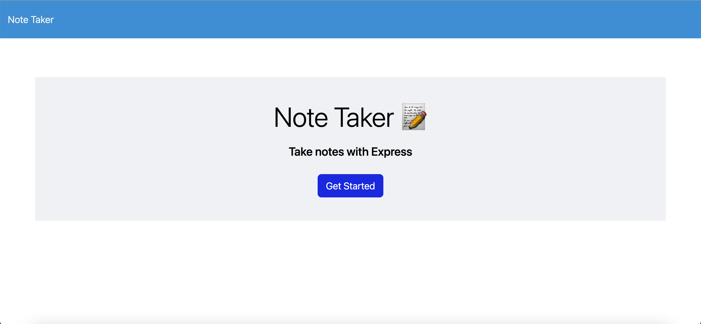

# Note-Taker

## Description

I produced this application in order for users to write and save notes. 

[Link to deployed application]()

## Installation

Clone project and run "npm i" in your terminal. Once you have everything installed, run "node server.js" this will bring up the localhost:3001. Click control +C, then the localhost:3001 and the application will show up in a separate window.

## Usage

## Credits

N/A

## License

[MIT](https://choosealicense.com/licenses/mit/)